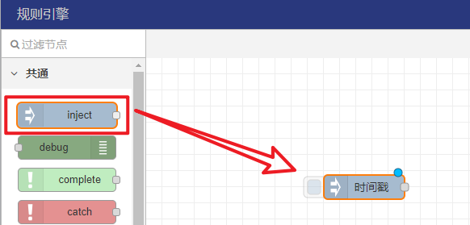
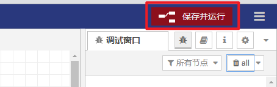
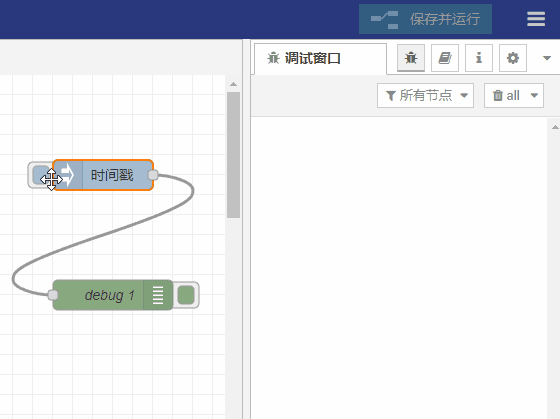

# 规则引擎

一款功能强大的可视化流编程工具

## 本地安装

1. `git clone https://github.com/ThingsPanel/rule-engine.git`
2. `cd rule-engine`
3. `npm install`
4. `npm start`
5. 在浏览器中打开 http://localhost:1880  

## 在线体验
http://dev.thingspanel.cn:1880/  

## 入门指南

### 1. 添加注入节点
注入节点允许您将消息注入流中，在左侧的节点中找到`inject`节点，把它拖动到编辑器中。如图所示：  

### 2. 添加调试节点  
`debug`节点会在调试侧栏中输出调试信息，在左侧的节点中找到`debug`节点，把它拖动到编辑器中。  

### 3. 将两者连接在一起  
通过在一个节点的输出端口与另一个节点的输入端口之间拖动来将 Inject 节点和 Debug 节点连接在一起。    
效果如图：  
  

### 4. 部署  
此时，节点仅存在于编辑器中，必须部署到服务器中才能生效。  
点击右上角的"保存并运行"按钮。  
  

### 5. 查看调试信息  
点击"注入"按钮。在调试信息栏中我们会看到输出的信息。  
  

### 6. 安装modbus节点
可能需要在容器里执行apk add gcc g++ make cmake gfortran libffi-dev openssl-dev libtool 安装运行环境
